# The YAVSAP report

Formerly known as "The Visualizer."

YAVSAP outputs a consolidated report containing statistics on your analysis and
the viral haplotypes found. The report is powered by [MultiQC], so you can view
it in any browser.

## Launching the report

The report can be viewed simply by double-clicking the `report/index.html` file
in your specified results folder, but for the best experience, you will need to
run a temporary server. Don't worry: it's not as daunting as it sounds. Just
follow the instructions below.

### Windows

You'll need to download some server software first. You won't need
administrative privileges for this, though.

#### First time only

1. Open a PowerShell terminal by pressing <kbd>WIN</kbd>+<kbd>X</kbd>, then
   <kbd>I</kbd>
2. Type `Set-ExecutionPolicy RemoteSigned -Scope CurrentUser` <kbd>ENTER</kbd>
   and answer `Y` to all the prompts
3. Type `Invoke-WebRequest get.scoop.sh | Invoke-Expression` <kbd>ENTER</kbd>
4. Type `scoop install python` <kbd>ENTER</kbd>
5. Close the PowerShell window

#### Every time

1. Copy the entire `report` directory from the server to a location on your
   local computer

   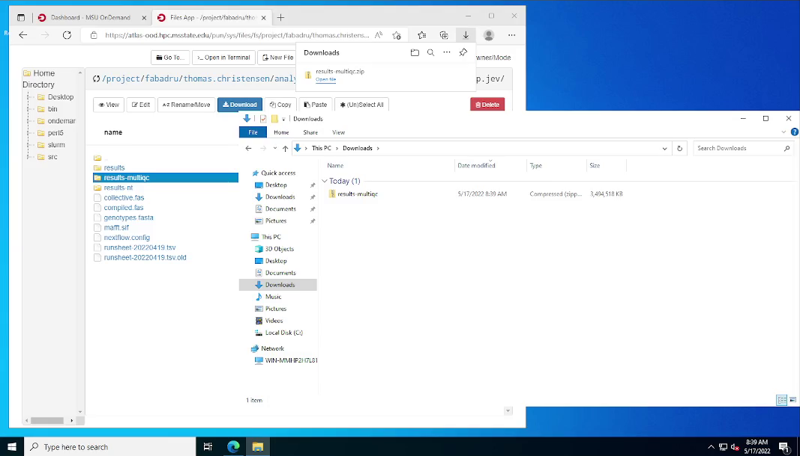

2. Open a PowerShell terminal by pressing <kbd>WIN</kbd>+<kbd>X</kbd>, then
   <kbd>I</kbd>

   

3. Type `cd` and paste the path of the `report` directory

   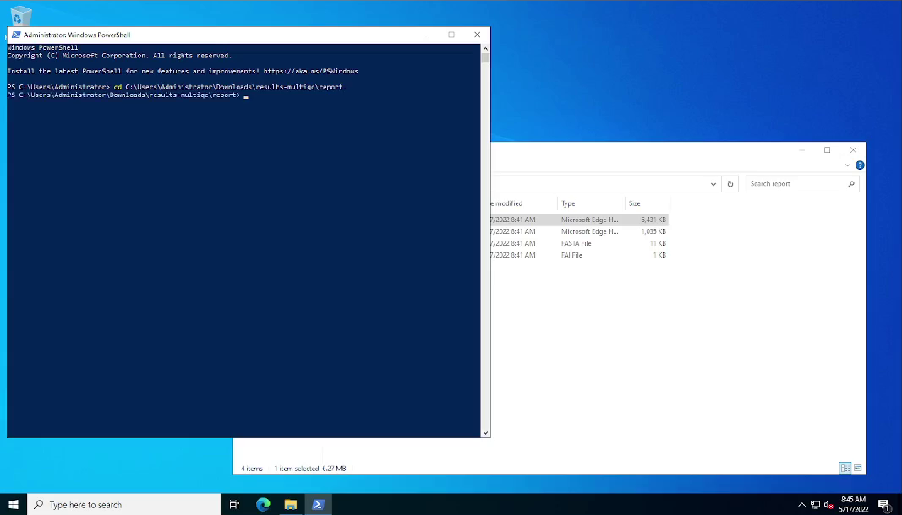

4. Type `python -m http.server 8000` <kbd>ENTER</kbd>

   

5. Open a browser, and navigate to <http://localhost:8000>

   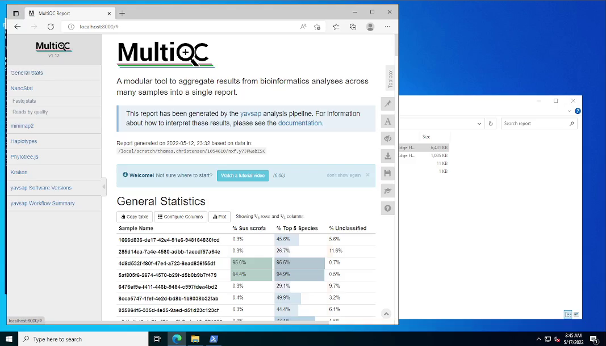

   ```{note}
   You can launch multiple reports at once by changing `8000` to another number
   in both the PowerShell window and the browser URL. Just make sure the number
   is larger than 1024, and for best results try to pick a number than doesn't
   appear on [this list](https://en.wikipedia.org/wiki/List_of_TCP_and_UDP_port_numbers#Registered_ports).
   ```

6. Once you are done with the report, close the browser, press
   <kbd>CTRL</kbd>+<kbd>C</kbd> in PowerShell, and close PowerShell

### Mac and Linux

Hooray! Mac and Linux desktops come with server software pre-installed!

1. Copy the entire `report` directory from the server to a location on your
   local computer

   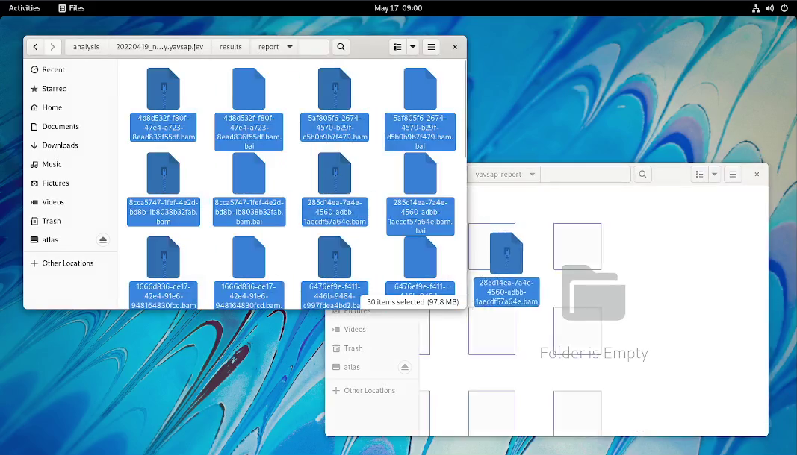

2. Open a new terminal window

   - **Mac**
     Press <kbd>CMD</kbd>+<kbd>SPACE</kbd>, type `terminal` and press enter
   - **Linux**
     Press <kbd>CTRL</kbd>+<kbd>ALT</kbd>+<kbd>T</kbd>

   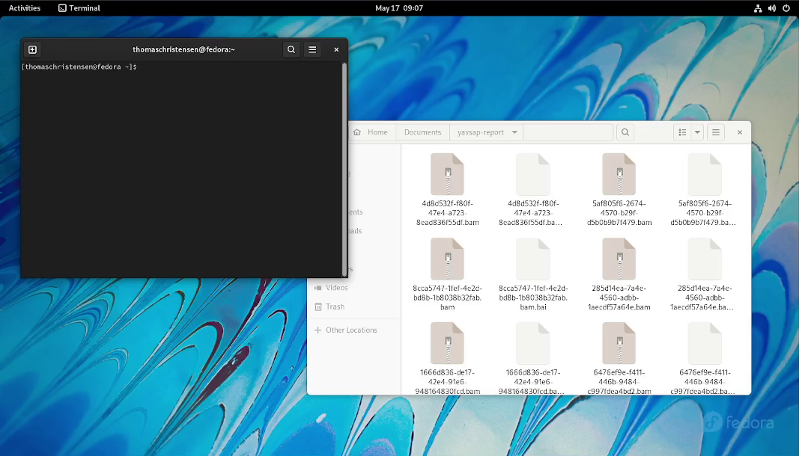

3. Type `cd` and the paste the path of the `report` directory

   

4. Type `python -m http.server 8000` <kbd>ENTER</kbd>

   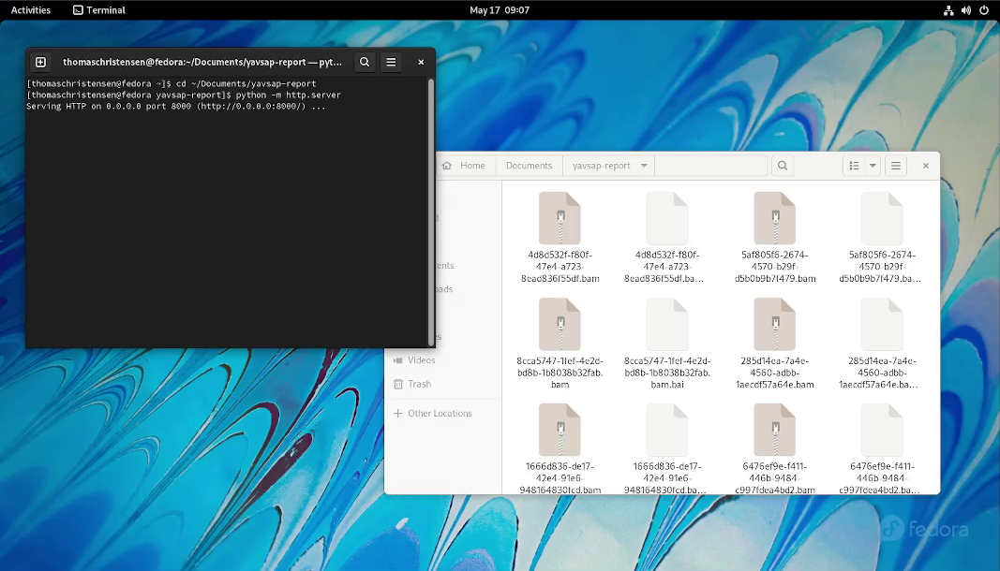

5. Open a browser, and navigate to <http://localhost:8000>

   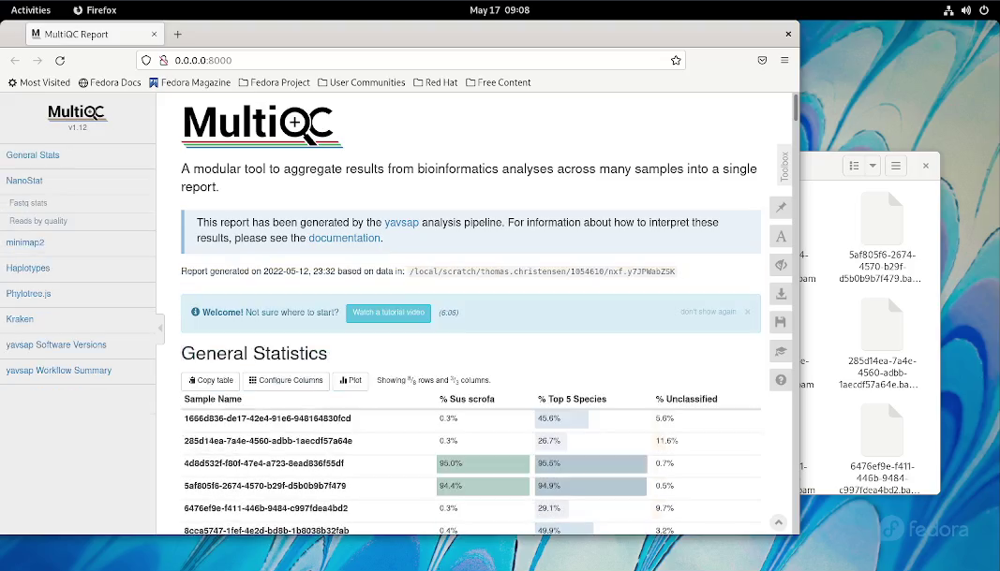

   ```{note}
   You can launch multiple reports at once by changing `8000` to another number
   in both the terminal window and the browser URL. Just make sure the number
   is larger than 1024, and for best results try to pick a number than doesn't
   appear on [this list](https://en.wikipedia.org/wiki/List_of_TCP_and_UDP_port_numbers#Registered_ports).
   ```

6. Once you are done with the report, close the browser, press
   <kbd>CTRL</kbd>+<kbd>C</kbd> in the terminal, and close the terminal

## Using the Report

Here's a section-by-section breakdown of how everything in the report works.

### General Statistics


A table with a general overview of statistics that MultiQC cares about. These
numbers have some limited use cases, but overall are just repeats of everything
contained in the other sections.

(FastQC)=

### FastQC (Illumina-only)


FastQC checks for

- **Number of reads per sample**
- **Read quality**
- Sequence read diversity
- GC content anomalies
- **Read length**
- Sequence duplication and over-representation
- **Adapter contamination**

Because YAVSAP is primarily a viral analysis pipeline for metagenomic reads,
diversity, GC content, and duplication are typically irrelevant: use them if you
know what you are doing.

#### Number of reads + read length

These two numbers can be used to estimate coverage. The equation for coverage
is[^1]

```{math}
---
label: coverage
---
c = \frac{LN}{G}
```

where

- {math}`c` = coverage
- {math}`L` = average read length
- {math}`N` = number of reads
- {math}`G` = genome length

For variant- and haplotype-calling purposes, the coverage {math}`c` should be
well in excess of 60.

#### Read quality

Illumina reads are famous for being high quality. If you have reads that fail in
the quality assessment, then there are likely errors in the upstream sample
preparation (extraction, amplification, library prep) or sequencing. Low-quality
reads _can_ be used by YAVSAP, but will reduce the ability to call variants and
haplotypes.

#### Adapter contamination

If adapters are found in your reads, then you can compensate by adjusting the
{ref}`read trimming options`. Note that FastQC runs _before_ read trimming, so
this check will fail even if the adapters are being trimmed off.

More detailed instructions for interpreting FastQC results can be found in [the
FastQC documentation].

---

(NanoStat)=

### NanoStat (Nanopore-only)

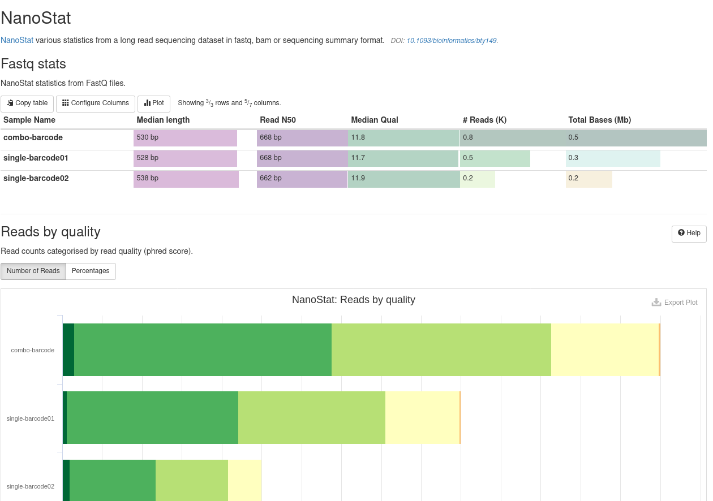

NanoStat calculates the

- Median read length
- N50 read length
- Median read quality
- Number of reads
- Total base count
- Read quality distribution

For long reads, the N50 is generally more informative than the median length.
Substituting {math}`L` = N50 into Equation {math:numref}`coverage` will give an
indication of the coverage of the sample.

If a large proportion of reads are low (&lt;Q10), then YAVSAP will struggle to
identify strains, and call variants and haplotypes. Quality that low indicates
errors in either the upstream sample preparation (extraction, library prep) or
sequencing, and the sequencing should be redone.

(Trimmomatic)=

### Trimmomatic (Illumina-only)

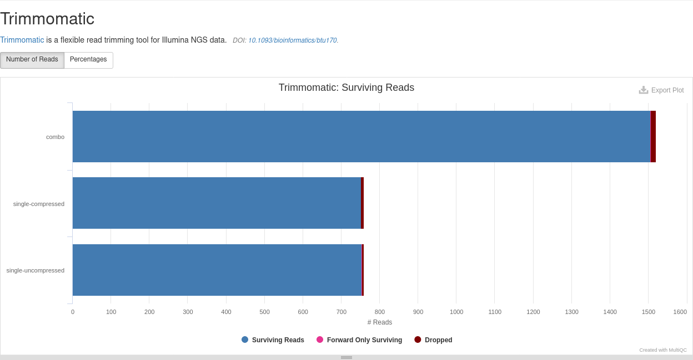

Trimmomatic removes adapters, low-quality reads, and ends of reads in a highly
configurable manner. This section shows how many reads were left by Trimmomatic.
Use this section in conjunction with {ref}`FastQC <FastQC>` to ensure only
high-quality sequence reads are processed by YAVSAP.

### Kraken

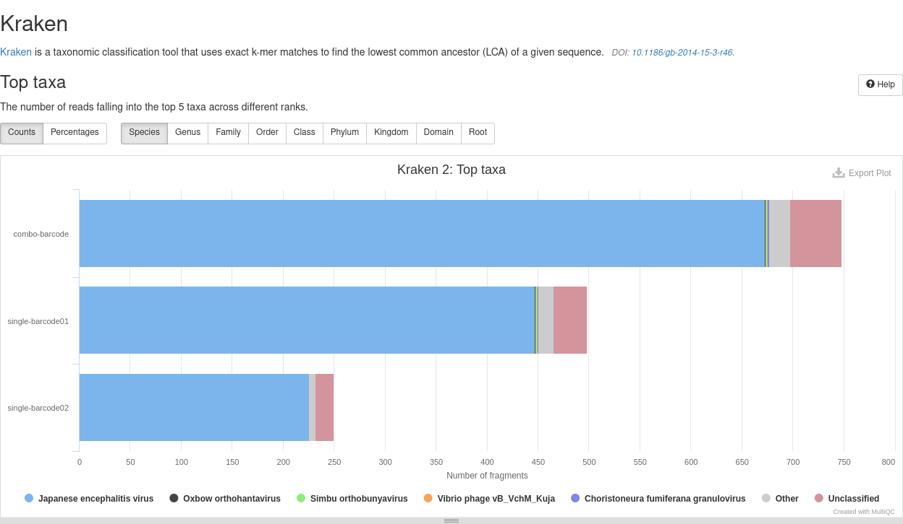

Kraken identifies whether sequencing reads belong to the virus of interest or
the host. This plot shows the five most abundant taxa in each sample pool.
Check this plot to see if host reads are overcoming the viral reads and
hindering the analysis. Depending on your Kraken database, host reads might be
`unclassified` and viral reads are identified, or it might be that host reads
are identified and viral reads are `unclassified`. The results from this plot
should be interpreted as the number of reads that will actually be analyzed by
YAVSAP.

#### Examples

##### Example 1

Virus
: SARS-CoV2 (SC2)

Host
: _Homo sapiens_ (human)

Kraken Database
: [standard](https://github.com/DerrickWood/kraken2/wiki/Manual#standard-kraken-2-database)

Kept reads
: `10239` (viral)

In this case, both the virus and host will be identified in `standard`. The plot
will show the abundances of both `Beta coronavirus` and `Homo sapiens` reads.
Thanks to the `--keep_taxid` value, we know that only SC2 and related, non-human
reads will be aligned and variant-called. High percentages of `Homo sapiens`
reads indicate low viral load or a faulty extraction and/or amplification
protocol.

##### Example 2

Virus
: Japanese Encephalitis Virus (JEV)

Host
: _Sus scrofa_ (domestic pig)

Kraken Database
: [standard](https://github.com/DerrickWood/kraken2/wiki/Manual#standard-kraken-2-database)

Kept reads
: `10239` (viral)

In this case, JEV is characterized in RefSeq, and its genome will be identified
with the `standard` Kraken database. In contrast, _Sus scrofa_ will be marked as
`unclassified` with this database, as non-human mammals are not included in
`standard`. In this case, the unclassified reads should be filtered out. High
percentages of `unclassified` indicate a faulty extraction protocol and/or an
amplification protocol that is too non-specific

##### Example 3

Virus
: Bovine Rotavirus (RV)

Host
: _Bos taurus_ (domestic cattle)

Kraken Database
: [nt](https://github.com/DerrickWood/kraken2/wiki/Manual#custom-databases)

Kept reads
: `10239` (viral)

RV is not present in RefSeq, and _Bos taurus_ is a non-human mammal, so both
would be `unclassified` if using `standard`. Instead, we switch to the `nt`
database. Both RV and _Bos taurus_ sequences are present in the `nt` database,
so a plot should be interpreted in the same manner as the
{ref}`first example<Example 1>`.

##### Example 4

Virus
: Foot and Mouth Disease Virus (FMDV)

Host
: _Homo sapiens_ (human)

Kraken Database
: [human](https://s3.console.aws.amazon.com/s3/object/nf-core-awsmegatests?prefix=viralrecon/input_data/kraken2_human.tar.gz)

Kept reads
: `unclassifed`

In this case, FMDV is in RefSeq, but it doesn't matter because the database only
contains human sequences. In this case _only_ the host reads will be identified,
so keep the `unclassifed` reads, and interpret them as viral reads.

### minimap2

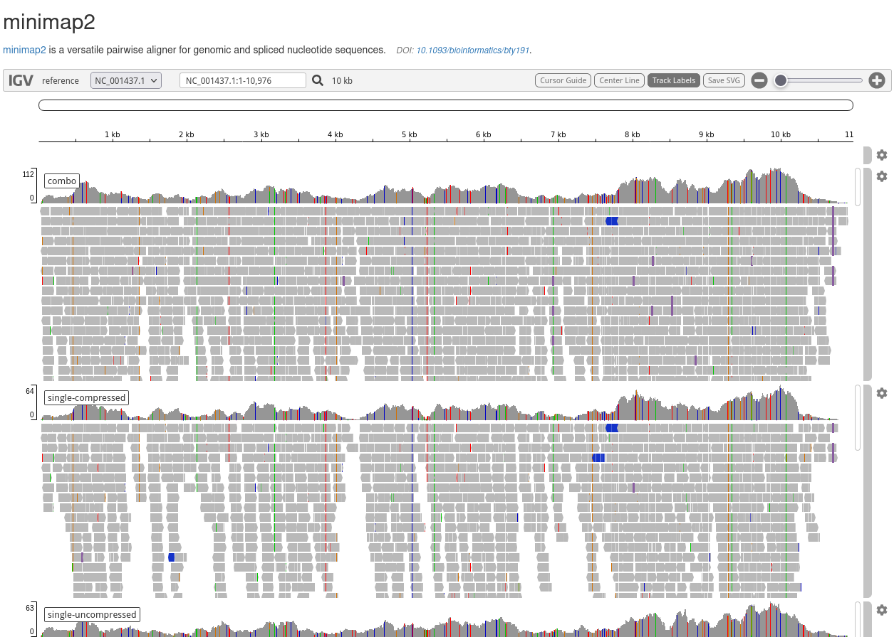

The alignments against the reference genome are displayed using [IGV]. The IGV
interface is described in detail at
<https://software.broadinstitute.org/software/igv/UserGuide>.

```{note}
There are minor differences between the desktop application and the web application.
```

Briefly, the reference genome is listed in the top, left corner. Display options
(cursor, labels, zoom) are located in the top, right corner. Immediately below
the gray bar the genome annotations are shown along the length of the reference
genome. These are colored based on the type of annotation.

- <span style="background-color: rgb(0,0,255);">Genome segment</span>
- <span style="background-color: rgb(0,178,0);">Gene</span>
- <span style="background-color: rgb(255,255,0);">CDS</span>
- <span style="background-color: rgb(0,90,40);">Mature peptide</span>
- <span style="background-color: rgb(170,170,170);">Miscellaneous feature</span>
- <span style="background-color: rgb(255,180,0);">Everything else</span>

A coverage graph is displayed in a histogram labelled with each sample name.
Along those coverage graphs, IGV will attempt to call variants using colored
bars. These variants **are not** precise, and **do not** reflect the variants
called by YAVSAP. Each gray bar below the coverage graph represents an aligned
read. Variant calls are also shown on the reads that support them. Variant calls
have the following legend:

- <span style="font-weight: 1000; color: #0000c8;">|</span>: C
- <span style="font-weight: 1000; color: #ff0000;">|</span>: T
- <span style="font-weight: 1000; color: #d17105;">|</span>: G
- <span style="font-weight: 1000; color: #00c800;">|</span>: A
- <span style="font-weight: 1000; color: #8a5ea1;">|</span>: Insertion
- <span style="font-weight: 1000; color: #000000;">&mdash;</span>: Deletion

IGV also attempts to call structural variants. These are generally meaningless
in the context of viral haplotyping, and should be verified with some other
tool.

- <span style="font-weight: 1000; font-size: larger; color: #b9b9b9;">
      &#10502;&#10503;
   </span>: Normal
- <span style="font-weight: 1000; font-size: larger; color: #1aa6a7;">
      &#10502;&#10503;
   </span>: Inversion
- <span style="font-weight: 1000; font-size: larger; color: #1432c8;">
      &#10502;&#10503;
   </span>: Inversion
- <span style="font-weight: 1000; font-size: larger; color: #13a44d;">
      &#10502;&#10503;
   </span>: Duplication or translocation

(Haplotypes-report)=

### Haplotypes (CliqueSNV for Illumina, HapLink.jl for Nanopore)


A rough multi-sequence alignment for every consensus sequence and haplotype
sequence found in each sample. The frequency of each minority haplotype, the
closest strain, and that strain's NCBI GenBank link is listed in the table. The
bases are colored (<span style="color: red;">A</span>, <span style="color:
blue;">C</span>, <span style="color: orange;">G</span>, <span style="color:
green;">T</span>), and every variant site is highlighted purple.

### RAxML-NG

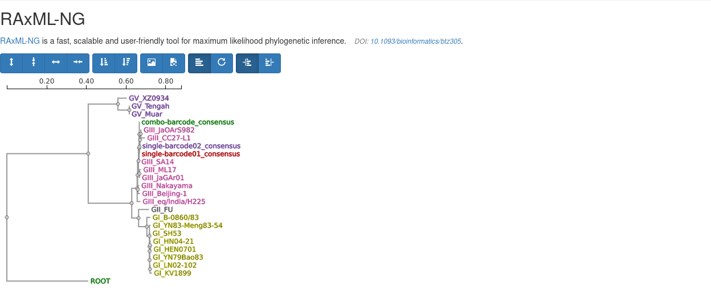

The phylogenetic tree of all consensus sequences and haplotypes, as well as all
the strains included in the genome list is shown in an interactive viewer. The
toolbar across the top has controls for

- Zoom
- Sorting
- Saving (image or Newick)
- Tree style (linear, circular)
- Alignment

Node names take the form of one of

- `<GENOTYPE>_<STRAIN>`
- `<SAMPLENAME>_consensus`
- `<SAMPLENAME>_haplotype_<HAPLOTYPE_ID>`

Each node is colored based on the node name before the first underscore (`_`).
This means that strains of the same genotype have the same color, and each
sample's consensus and haplotype sequences all have the same colors. There are
only 10 colors, so having more samples than that might result in color
collision. In that case, it may be advisable to download the Newick file and
reformat it in another tree program.

### Software Versions

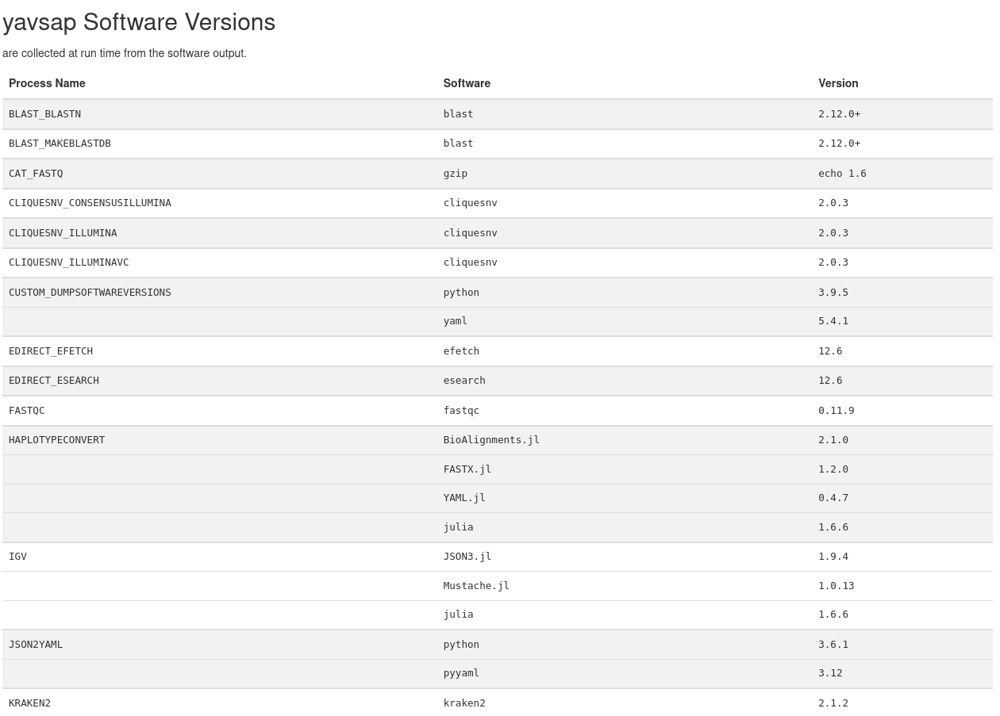

A table of all the software used to produce the report. Just to make sure you
give credit where it is due.

### Workflow Summary

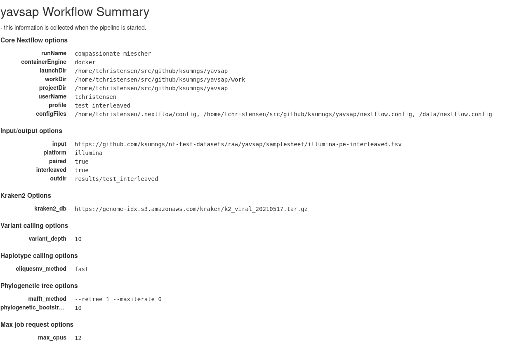

A list of all the parameters (and various other metadata) used to produce this
particular analysis and report. Sort of a light version of the
{ref}`Nextflow report <execution-report>`.

[^1]: Lander ES, Waterman MS. Genomic mapping by fingerprinting random clones: a mathematical analysis. Genomics. 1988 Apr;2(3):231-9. doi: 10.1016/0888-7543(88)90007-9. PMID: 3294162.

[multiqc]: https://multiqc.info/
[igv]: https://igv.org/
[the fastqc documentation]: https://www.bioinformatics.babraham.ac.uk/projects/fastqc/Help/
